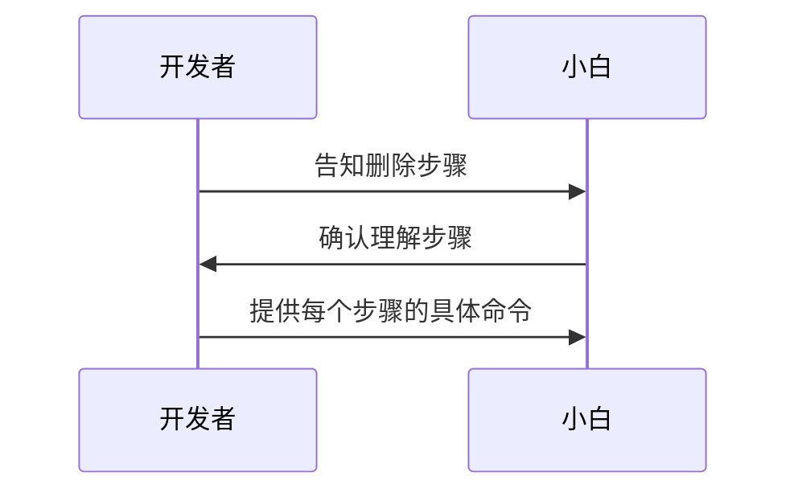

# 本文是在 Ubuntu 中彻底卸载 Docker 和 Docker Compose 的教程。

## 一、删除 Docker 和 Docker Compose 的步骤

| 步骤 | 描述                       |
| :--: | :-----------------------: |
| 1    | 停止并删除所有 Docker 容器 |
| 2    | 删除所有 Docker 镜像       |
| 3    | 卸载 Docker 软件           |
| 4    | 删除相关的存储目录         |
| 5    | 清理系统文件和配置         |
| 6    | 删除 Docker Compose        |


## 二、执行步骤

### **Step 1：停止并删除所有 Docker 容器**

首先，我们需要停止并删除所有的Docker容器。使用以下命令：

```bash
docker stop $(docker ps -a -q)
```

该命令将停止所有正在运行的 Docker 容器。

```bash
docker rm $(docker ps -a -q)
```

该命令将删除所有的 Docker 容器。

### **Step 2：删除所有 Docker 镜像**

接下来，我们需要删除所有的Docker镜像。使用以下命令：

```bash
docker rmi $(docker images -q)
```

该命令将删除所有的 Docker 镜像。

### **Step 3：卸载 Docker 软件**

现在，我们需要卸载 Docker 软件。使用以下命令：

```bash
sudo apt-get purge docker-ce docker-ce-cli containerd.io
```

该命令将卸载Docker软件。

### **Step 4：删除相关的存储目录**

然后，我们需要删除与 Docker 相关的存储目录。使用以下命令：

```bash
sudo rm -rf /var/lib/docker
```

该命令将删除Docker的存储目录。

### **Step 5：清理系统文件和配置**

然后，我们需要清理系统文件和配置。使用以下命令：

```bash
sudo rm -rf /etc/docker
sudo rm -rf /etc/systemd/system/docker.service.d
sudo rm -rf /etc/docker/daemon.json
```

该命令将删除与 Docker 相关的系统文件和配置。

### **Step 6：删除 Docker Compose**

最后，我们需要删除 Docker Compose。使用以下命令：

```bash
rm /usr/local/bin/docker-compose
```

该命令将删除 Docker Compose。

## 三、流程图


